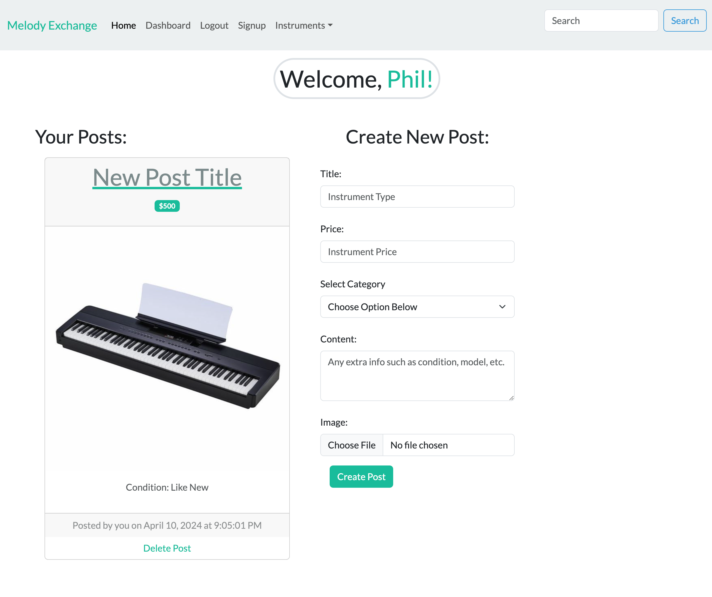
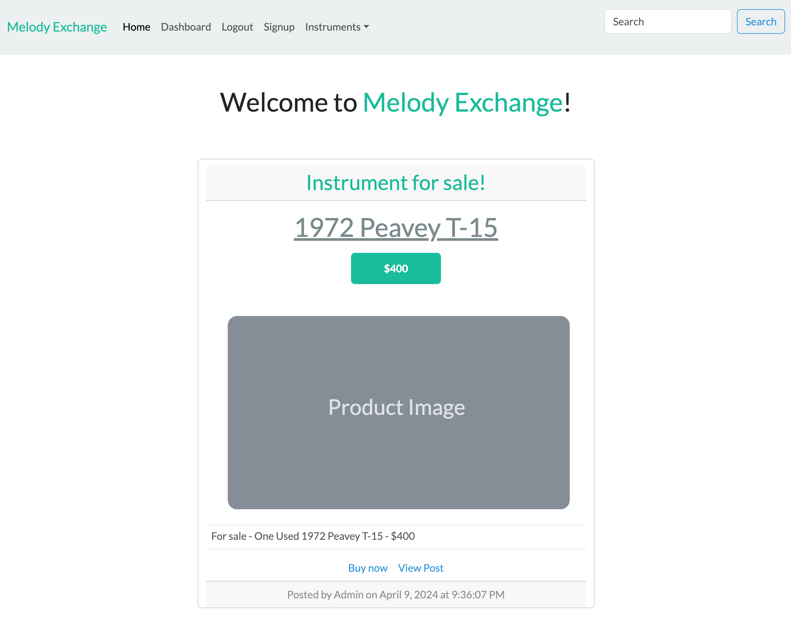
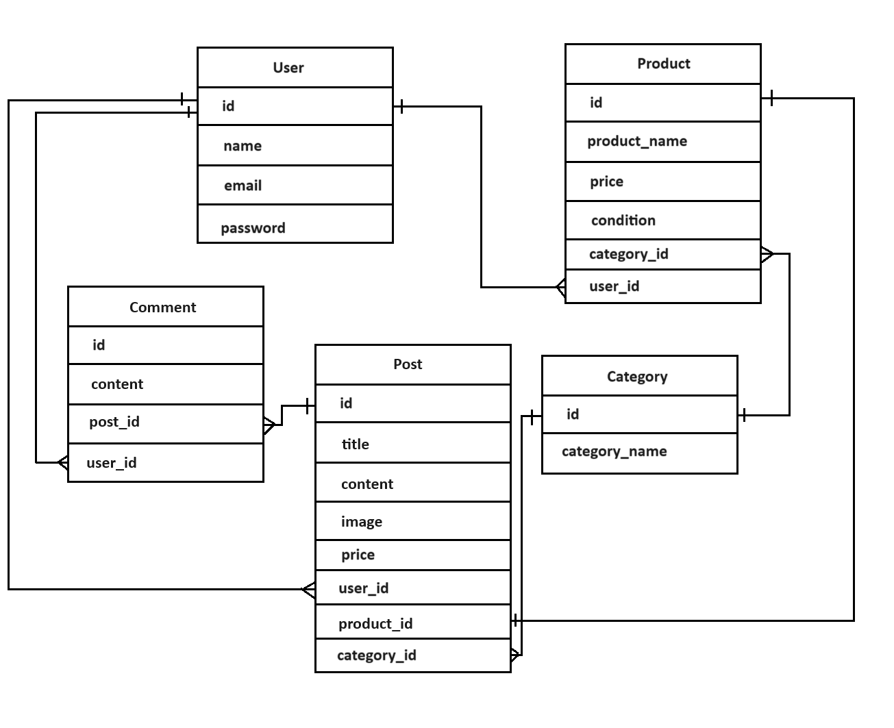

# Melody Exchange

## Overview
   - As a user, you will be able to sign up for an account on our website, "Melody Exchange", and create posts to sell your instrument.

## Features

1. Category Dropdown

   * Our group implemented a dropdown with all the different categories allowed in our website. This allows for easier access to a specific post with a specific category.

2. Clean UI design

    * We chose to have our website display a simple, yet sleek design for all pages.

3. User Signup and Login page

    * We added the option for users to create an account when visiting the signup page. After signup, the user is allowed to log into their account and have the option to start creating posts as they wish.

4. Create post Form

    * Our create post form allows users to create a post and have the option to add a title, price, instrument category, extra post text, and also the ability to add and image.

5. Add image functionality

    * By implementing the Cloudinary package, we were able to add the option for the user to add an image of their own!

6. Comment functionality

    * Our group implemented the option for signed up users to create a comment underneath each post.

7. Technologies Used

    * Node
    * Bootswatch
    * Handelbars
    * Javascript
    * SQL
    * Sequelize
    * NPM package- Cloudinary

## Usage
To view this webpage, please visit https://jmp-melody-exchange-6320a3cefa5d.herokuapp.com/

To view this project's repository, please visit https://github.com/JoshMassa/melody-exchange

When viewing the homepage, the webpage should resemble the following image:

When viewed from the dashboard page, the webpage should resemble the following image:

## ERD Model
The image below is the ERD diagram that represents the models and asociations we used for this project

## Credits

Links to resources used as follows:

Bootstwatch: https://bootswatch.com/

Multer: https://www.npmjs.com/package/multer

Sequelize: https://sequelize.org/

## License
This project does not contain a license.

